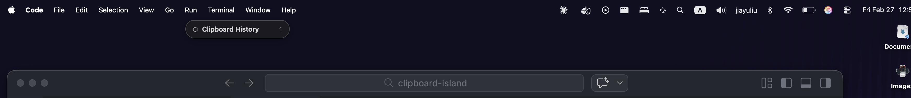

# Clipboard Island

A macOS floating clipboard manager inspired by Windows' built-in clipboard (Win+V). Built with [Wails v3](https://v3.wails.io/) (Go + vanilla JS).



## Features

- 📋 **Text & Image Support** - Copy text or screenshots, both appear in the floating panel
- 📌 **Pin Items** - Keep important clips across app restarts
- 🎯 **One-Click Paste** - Click or press Enter to paste at cursor position
- ⌨️ **Keyboard Navigation** - Arrow keys to select, Enter to paste, Escape to dismiss
- 💾 **Persistent** - Pinned items saved to disk
- 🖼️ **Image Resizing** - Screenshots resized to 1200px max (readable text, ~70% smaller)
- 🚫 **Duplicate Prevention** - Won't add same content twice

## Installation

```bash
# Build the app
wails3 build

# Or download from releases (when available)
```

The binary will be at `bin/clipboard-island`.

## Usage

1. **Copy** anything (Cmd+C or screenshot with Cmd+Shift+4)
2. **Open** Clipboard Island with **Cmd+Shift+V**
3. **Navigate** with ↑/↓ arrow keys or mouse
4. **Paste** with Enter or click on an item
5. **Pin** ☆ items you want to keep (persists across restarts)
6. **Delete** × items you don't need

### Keyboard Shortcuts

| Shortcut | Action |
|----------|--------|
| `Cmd+Shift+V` | Show/hide clipboard island |
| `↑` / `↓` | Navigate items (wraps around) |
| `Enter` | Paste selected item |
| `Escape` | Dismiss without pasting |

## Development

```bash
# Run tests
go test ./...

# Build for production
wails3 build

# Run in dev mode (hot reload)
wails3 dev

# Build frontend only
cd frontend && npm run build
```

**Note**: `go run .` only compiles Go code. If you changed frontend files (HTML/CSS/JS), run `wails3 build` first.

## Architecture

| Component | Technology |
|-----------|------------|
| Backend | Go 1.25, Wails v3 |
| Frontend | Vanilla JS, Vite |
| Hotkey | `golang.design/x/hotkey` |
| Clipboard | `golang.design/x/clipboard` |
| Persistence | JSON via `adrg/xdg` |

### Key Files

- `main.go` - App bootstrap, window config, hotkey, clipboard watcher
- `app.go` - App service, focus capture/restore
- `clipboard.go` - Core clipboard logic (add, get, pin, delete, persist)
- `clipboard_darwin.go` - macOS CGo helpers
- `clipboard_test.go` - 46 unit tests
- `frontend/src/main.js` - UI rendering, keyboard handling
- `frontend/public/style.css` - macOS-native styling

## How It Works

1. **Clipboard Watching** - Polls every 200ms (1s when idle) for changes
2. **Image Handling** - Resizes large images to 1200px max, stores as base64
3. **History** - Keeps last 30 items, pinned items never evicted
4. **Pasting** - Writes to clipboard, restores previous app focus, simulates Cmd+V
5. **Persistence** - Pinned items saved to `~/.clipboard-island/history.json`

## Requirements

- macOS (uses CGo, AppleScript, `ActivationPolicyAccessory`)
- Go 1.25+
- Wails CLI v3

## License

MIT

## Acknowledgments

- Built with [Wails v3](https://v3.wails.io/)
- Inspired by Windows' built-in clipboard manager
